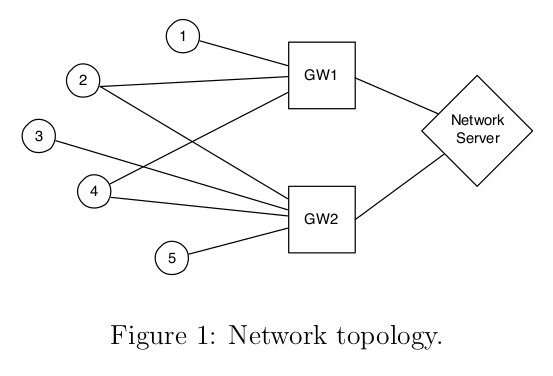

# Challenges_and_Project_IoT_2023

<!-- PROJECT LOGO -->
 

  

<h3 align="center">Challenges and Project IoT 2023</h3>
 

<!-- ABOUT THE PROJECT -->
## Challenges :boom:

### Challenge 1:

The first challenge was about traffic analysis. In particular, we were given a pcap file and we had to answer to 6 questions.

The main topic of the questions was counting the number of CoAP or MQTT messages were captured in the pcap file, given some conditions (request type, destination of the message, communication to a specific topic, etc.).

For more information on the assignment, check [here](Challenges/Challenge_1/src/resources/Challenge_1.pdf).

For half of the questions, I used the scapy library in Python in order to write scripts that would offer me an answer to the questions. The other half has been solved using Wireshark filtering.

For more in depth information, please read the [report](Challenges/Challenge_1/src/resources/Answers.pdf) and the [source code](Challenges/Challenge_1/src/main.py).

(<a href="#readme-top">back to top</a>)

### Challenge 2:

The second challenge was about Node-Red. 

Starting from a csv file, we had to pseudo-randomly choose a row and check the type of the message: if it was an MQTT publish, we had to publish a message to a topic specified in the requirements.

Then, the Node-Red flow had to subscribe to that topic, get the messages we were publishing, keep only those messages which temperature measure was in Celsius, and create a temperature chart with those values.

For more information on the assignment, check [here](Challenges/Challenge_2/resources/Challenge2.pdf).

The main functionalities of row-extraction in the csv file and of message-filtering were implemented in the function nodes of the Node-Red flow in JavaScript.

To check our implementation, please see our [report](Challenges/Challenge_2/resources/Report.pdf) and the [js scripts](Challenges/Challenge_2/resources/function_nodes_scripts).

(<a href="#readme-top">back to top</a>)

### Challenge 3:

The third challenge was about TinyOS and TOSSIM.

We had to implement a simple routing protocol based on broadcasting strating from a provided sketch. Before transmitting a message, each node checks its routing table to see if a route is present for the selected destination: if it is, the message is forwarded to the next hop, otherwise a ROUTE_REQ message is sent in broadcast. When the actual destination will receive a ROUTE_REQ message, it will answer in broadcast with a ROUTE_REPLY.

For more information on the assignment, check [here](Challenges/Challenge_3/resources/Challenge3.pdf).

We implemented the functionalities using the nesC programming language (strictly related to TinyOS), in particular the most interesting files are [RadioRoute.h](Challenges/Challenge_3/src/RadioRoute.h) for the structure of the messages exchanged over the network, [RadioRouteAppC.nc](Challenges/Challenge_3/src/RadioRouteAppC.nc) for the declaration of the interfaces that has been used, and [RadioRouteC.nc](Challenges/Challenge_3/src/RadioRouteC.nc) for the actual implementation. Then we simulated it thanks to the [simulation script](Challenges/Challenge_3/src/RunSimulationScript.py), that uses the TOSSIM library.

Visit the [report](Challenges/Challenge_3/resources/Deliverables/report.pdf) and the linked pages to understand the actual implementation of the network and of the nodes.

(<a href="#readme-top">back to top</a>)

## Project: LoraWAN-like Sensor Network 💻

The project assignment asked to implement a network architecture similar to LoraWAN in TinyOS.

In particular, we had to respect the following requirements:
* The topology counts five sensor nodes, two gateways, and one server node. as illustrated in the following figure

  

* Each sensor node periodically transmits (random) data, which is received by one or more gateways, which forward the received data to the network server.
* Network server removes duplicated messages. An ACK message is sent back to the forwarding gateway, which in turn transmits it to the nodes. If a node does not receive an ACK within a 1-second window, the message is re-transmitted.
* The network server node should be connected to Node-RED, and periodically transmit data from sensor nodes to our private Thingspeak channel through MQTT.
* Thingspeak must show at least three charts on a public channel.

(<a href="#readme-top">back to top</a>)

## Implementation 🎯

In this section we list the key concepts we adopted and implemented in our solution of the project:
* `transmitted_to_second_gateway`: this boolean variable is used to manage transmission of a message from a sensor node to both the gateway (for those nodes that should do it by topology). After the transmission of the first copy of the message, and we need to transmit the second one, we check this variable when the `sendDone` event is triggered: if it is FALSE we start again the sending process to forward the data to the second gateway, otherwise we ignore the event.
*  `last_message_transmitted msg_tx`: when a sensor node sends a message, it saves its content inside this variable in order to be able to fetch the data again in case if the 1-second window elapses and a retransmission is needed.
*  `last_message_received msg_from_sensor[SENSOR_NODES]`: the server keeps track of the last message it received from all the sensor nodes. In this way, it can recognize duplicates and discard them.

If you would like to know how the send and receive function are implemented in details, you could check out the script [SenseNetC.nc](Project/src/SenseNetC.nc).

(<a href="#readme-top">back to top</a>)

<!-- LICENSE -->
## License 📄

Distributed under the `MIT` License. See `LICENSE` for more information.

(<a href="#readme-top">back to top</a>)

<!-- CONTACT -->
## Group Members 👥

* [Mario Cela](https://github.com/MarioCela): mario.cela@mail.polimi.it
* [Riaz Luis](https://github.com/riuls): riazluis.ahmed@mail.polimi.it

(<a href="#readme-top">back to top</a>)

